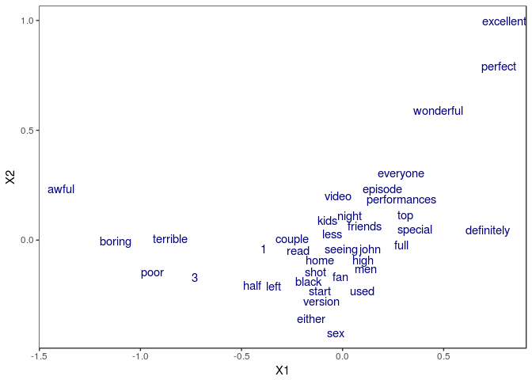
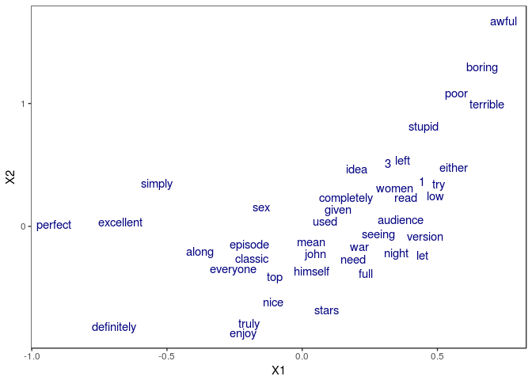

RNN made easy with MXNet R
================

This tutorial presents an example of application of RNN to text classification using padded and bucketed data to efficiently handle sequences of varying lengths. Some functionalities require running on a GPU with CUDA.

Example based on sentiment analysis on the [IMDB data](http://ai.stanford.edu/~amaas/data/sentiment/).

What's special about sequence modeling?
---------------------------------------

Whether we're working with times series or text at the character or word level, modeling sequences typically involves dealing with samples of varying length.

This can present some challenges as the explicit representation of an unrolled RNN involves a fixed length sequence. The operator `mx.symbol.RNN` simplifies the process by abstracting the recurrent cells into a single operator that accepts sequences of varying lengths.

To efficiently feed the RNN network, two tricks can be used:

-   Padding: fill the modeled sequences with an arbitrary word/character up to the longest sequence. This results in sequences of even lengths, but potentially of excessive size for an efficient training.

-   Bucketing: apply the padding trick but to subgroups of samples split according to their lengths. This results in multiples training sets, or buckets, within which all samples are padded to an even length.

Data preparation
----------------

Data preparation is performed by the script `data_preprocessing_seq_to_one.R` which involves the following steps:

-   Import IMDB data
-   Split each review into word vectors and apply some common cleansing (remove special characters, lower case, remove extra blank space...)
-   Convert words into integers and define a dictionary to map the resulting indices with former words
-   Aggregate the buckets of samples and labels into a list

To illustrate the benefit of bucketing, two datasets are created:

-   `corpus_single_train.rds`: no bucketing, all samples are padded/trimmed to 600 words.
-   `corpus_bucketed_train.rds`: samples split into 5 buckets of length 100, 150, 250, 400 and 600.

Below is the example of the assignation of the bucketed data and labels into `mx.io.bucket.iter` iterator. This iterator behaves essentially the same as the `mx.io.arrayiter` except that is pushes samples coming from the different buckets along with a bucketID to identify the appropriate network to use.

``` r
corpus_bucketed_train <- readRDS(file = "data/corpus_bucketed_train.rds")
corpus_bucketed_test <- readRDS(file = "data/corpus_bucketed_test.rds")

vocab <- length(corpus_bucketed_test$dic)

### Create iterators
batch.size = 64

train.data.bucket <- mx.io.bucket.iter(buckets = corpus_bucketed_train$buckets, batch.size = batch.size, 
                                data.mask.element = 0, shuffle = TRUE)

eval.data.bucket <- mx.io.bucket.iter(buckets = corpus_bucketed_test$buckets, batch.size = batch.size, 
                               data.mask.element = 0, shuffle = FALSE)
```

Define the architecture
-----------------------

Below are the graph representations of a seq-to-one architecture with LSTM cells. Note that input data is of shape `batch.size x seq.length` while the output of the RNN operator is of shape `hidden.features X batch.size X seq.length`.

For bucketing, a list of symbols is defined, one for each bucket length. At training time, the appropriate symbol will be bind at each batch according the the bucketID provided by the iterator.

``` r
symbol_single <- rnn.graph(config = "seq-to-one", cell.type = "lstm", 
                           num.rnn.layer = 1, num.embed = 2, num.hidden = 4, num.label = 2, 
                           input.size = vocab, dropout = 0.5, ignore_label = -1,
                           output_last_state = F, masking = T)
```

``` r
bucket_list <- unique(c(train.data.bucket$bucket.names, eval.data.bucket$bucket.names))

symbol_buckets <- sapply(bucket_list, function(seq) {
  rnn.graph(config = "seq-to-one", cell.type = "lstm", 
            num.rnn.layer = 1, num.embed = 2, num.hidden = 4, num.label = 2, 
            input.size = vocab, dropout = 0.5, ignore_label = -1,
            output_last_state = F, masking = T)
})

graph.viz(symbol_buckets[[1]], type = "graph", direction = "LR", 
          graph.height.px = 50, graph.width.px = 800, shape=c(64, 5))
```



Train the model
---------------

First the non bucketed model is trained for 5 epochs:

``` r
devices <- mx.gpu(0)

initializer <- mx.init.Xavier(rnd_type = "gaussian", factor_type = "avg", magnitude = 2.5)

optimizer <- mx.opt.create("rmsprop", learning.rate = 1e-3, gamma1 = 0.95, gamma2 = 0.95, 
                           wd = 1e-4, clip_gradient = 5, rescale.grad=1/batch.size)

logger <- mx.metric.logger()
epoch.end.callback <- mx.callback.log.train.metric(period = 1, logger = logger)
batch.end.callback <- mx.callback.log.train.metric(period = 50)

system.time(
  model <- mx.model.buckets(symbol = symbol_single,
                            train.data = train.data.single, eval.data = eval.data.single,
                            num.round = 5, ctx = devices, verbose = FALSE,
                            metric = mx.metric.accuracy, optimizer = optimizer,  
                            initializer = initializer,
                            batch.end.callback = NULL, 
                            epoch.end.callback = epoch.end.callback)
)
```

    ##    user  system elapsed 
    ## 166.588  20.236 176.745



Now training with the bucketing trick. Note that no additional effort is required: just need to provide a list of symbols rather than a single one and have an iterator pushing samples from the different buckets.

``` r
devices <- mx.gpu(0)

initializer <- mx.init.Xavier(rnd_type = "gaussian", factor_type = "avg", magnitude = 2.5)

optimizer <- mx.opt.create("rmsprop", learning.rate = 1e-3, gamma1 = 0.95, gamma2 = 0.95, 
                           wd = 1e-4, clip_gradient = 5, rescale.grad=1/batch.size)

logger <- mx.metric.logger()
epoch.end.callback <- mx.callback.log.train.metric(period = 1, logger = logger)
batch.end.callback <- mx.callback.log.train.metric(period = 50)

system.time(
  model <- mx.model.buckets(symbol = symbol_buckets,
                            train.data = train.data.bucket, eval.data = eval.data.bucket,
                            num.round = 5, ctx = devices, verbose = FALSE,
                            metric = mx.metric.accuracy, optimizer = optimizer,  
                            initializer = initializer,
                            batch.end.callback = NULL, 
                            epoch.end.callback = epoch.end.callback)
)
```

    ##    user  system elapsed 
    ## 103.189  14.169 104.127

``` r
mx.model.save(model, prefix = "models/model_sentiment_lstm", iteration = 5)
```


The speedup is substantial, around 100 sec. instead of 175 sec., over 40% time reduction with little effort!

Plot word embeddings
--------------------

Word representation can be visualized by looking at the assigned weights in any of the embedding dimensions. Here, we look simultaneously at the two embeddings learnt in the LSTM model.


Inference on test data
----------------------

The utility function `mx.infer.buckets` has been added to simplify inference on RNN with bucketed data.

``` r
ctx <- mx.gpu(0)
batch.size <- 64

corpus_bucketed_test <- readRDS(file = "data/corpus_bucketed_test.rds")

test.data <- mx.io.bucket.iter(buckets = corpus_bucketed_test$buckets, batch.size = batch.size, 
                               data.mask.element = 0, shuffle = FALSE)
```

``` r
model <- mx.model.load(prefix = "models/model_sentiment_lstm", iteration = 5)
infer <- mx.infer.buckets(infer.data = test.data, model = model, ctx = ctx)

pred_raw <- t(as.array(infer))
pred <- max.col(pred_raw, tie = "first") - 1
label <- unlist(lapply(corpus_bucketed_test$buckets, function(x) x$label))

acc <- sum(label == pred)/length(label)
roc <- roc(predictions = pred_raw[, 2], labels = factor(label))
auc <- auc(roc)
```

Accuracy: 88.3%

AUC: 0.9512
