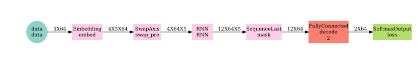
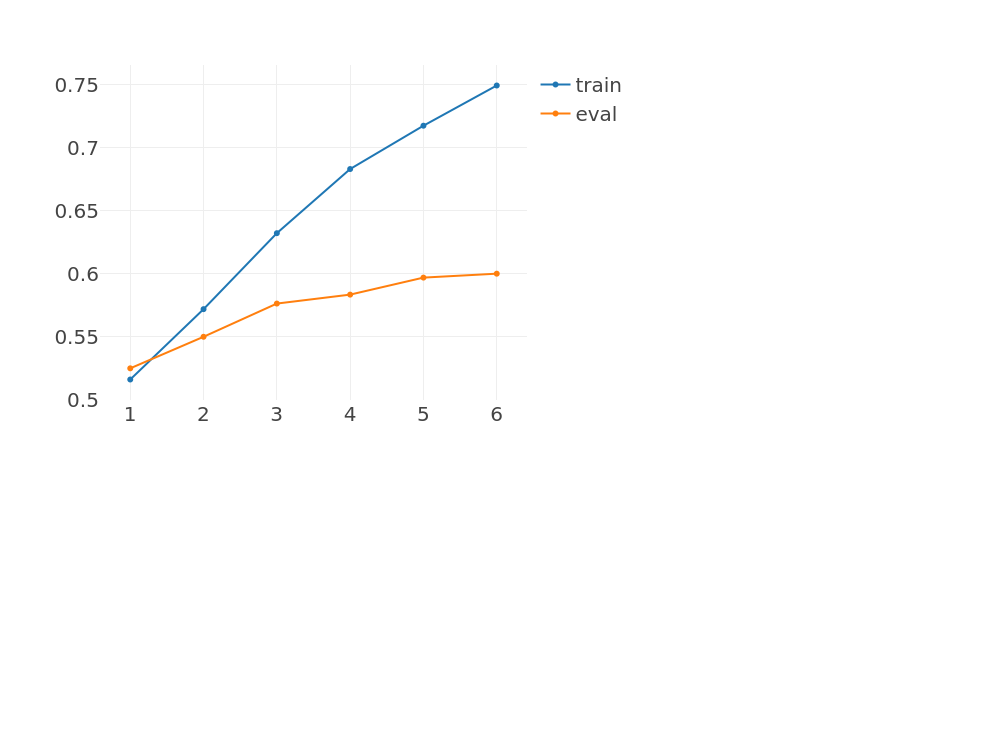
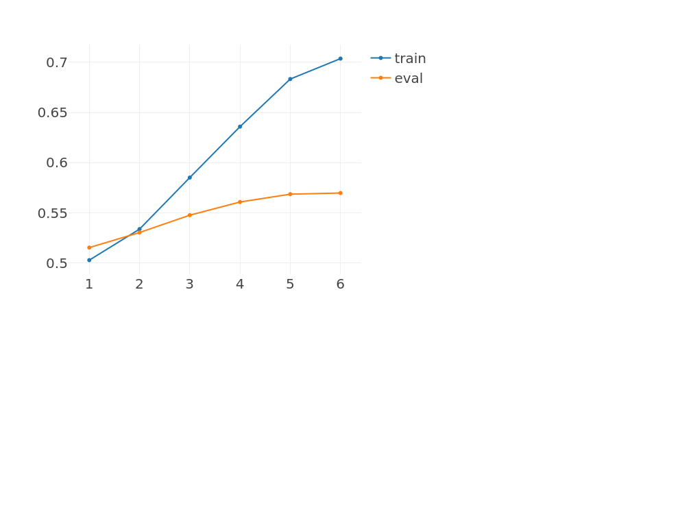

RNN made easy with MXNet R
================

This tutorial presents an example of application of RNN to text classification using padded and bucketed data to efficiently handle sequences of varying lengths. Some functionalities require running on a GPU with CUDA.

Example based on sentiment analysis on the [IMDB data](http://ai.stanford.edu/~amaas/data/sentiment/).

What's special about sequence modeling?
---------------------------------------

Whether working with times series or text at the character or word level, modeling sequences typically involves dealing with samples of varying length.

To efficiently feed the Recurrent Neural Network (RNN) with samples of even length within each batch, two tricks can be used:

-   Padding: fill the modeled sequences with an arbitrary word/character up to the longest sequence. This results in sequences of even lengths, but potentially of excessive size for an efficient training.


-   Bucketing: apply the padding trick to subgroups of samples split according to their lengths. It results in multiple training sets, or buckets, within which all samples are padded to an even length. Diagram below illustrates how the two previous samples would be pre-processed if using buckets of size 4 and 6.


Non numeric features such as words need to be transformed into a numeric representation. This task is commonly performed by the embedding operator which first requires to convert words into a 0 based index. The embedding will map a vector of features based on that index. In the example below, the embedding projects each word into 2 new numeric features.


Data preparation
----------------

For this demo, the data preparation is performed by the script `data_preprocessing_seq_to_one.R` which involves the following steps:

-   Import IMDB movie reviews
-   Split each review into a word vector and apply some common cleansing (remove special characters, lower case, remove extra blank space...)
-   Convert words into integers and define a dictionary to map the resulting indices with former words
-   Aggregate the buckets of samples and labels into a list

To illustrate the benefit of bucketing, two datasets are created:

-   `corpus_single_train.rds`: no bucketing, all samples are padded/trimmed to 600 words.
-   `corpus_bucketed_train.rds`: samples split into 5 buckets of length 100, 150, 250, 400 and 600.

Below is the example of the assignation of the bucketed data and labels into `mx.io.bucket.iter` iterator. This iterator behaves essentially the same as the `mx.io.arrayiter` except that is pushes samples coming from the different buckets along with a bucketID to identify the appropriate network to use.

``` r
corpus_bucketed_train <- readRDS(file = "data/corpus_bucketed_train.rds")
corpus_bucketed_test <- readRDS(file = "data/corpus_bucketed_test.rds")

vocab <- length(corpus_bucketed_test$dic)

### Create iterators
batch.size = 64

train.data.bucket <- mx.io.bucket.iter(buckets = corpus_bucketed_train$buckets, batch.size = batch.size, 
                                data.mask.element = 0, shuffle = TRUE)

eval.data.bucket <- mx.io.bucket.iter(buckets = corpus_bucketed_test$buckets, batch.size = batch.size, 
                               data.mask.element = 0, shuffle = FALSE)
```

Define the architecture
-----------------------

Below are the graph representations of a seq-to-one architecture with LSTM cells. Note that input data is of shape `batch.size X seq.length` while the output of the RNN operator is of shape `hidden.features X batch.size X seq.length`.

For bucketing, a list of symbols is defined, one for each bucket length. During training, at each batch the appropriate symbol is bound according to the bucketID provided by the iterator.

``` r
symbol_single <- rnn.graph(config = "seq-to-one", cell_type = "lstm", 
                           num_rnn_layer = 1, num_embed = 3, num_hidden = 12, 
                           num_decode = 2, input_size = vocab, dropout = 0, 
                           ignore_label = -1, loss_output = "softmax",
                           output_last_state = F, masking = T)
```

``` r
bucket_list <- unique(c(train.data.bucket$bucket.names, eval.data.bucket$bucket.names))

symbol_buckets <- sapply(bucket_list, function(seq) {
  rnn.graph(config = "seq-to-one", cell_type = "lstm", 
            num_rnn_layer = 1, num_embed = 4, num_hidden = 8, 
            num_decode = 2, input_size = vocab, dropout = 0.2, 
            ignore_label = -1, loss_output = "softmax",
            output_last_state = F, masking = T)
})

graph.viz(symbol_single, type = "graph", direction = "LR", 
          graph.height.px = 50, graph.width.px = 800, shape=c(5, 64))
```



The representation of an unrolled RNN typically assumes a fixed length sequence. The operator `mx.symbol.RNN` simplifies the process by abstracting the recurrent cells into a single operator that accepts batches of varying length (each batch contains sequences of identical length).

Train the model
---------------

First the non bucketed model is trained for 6 epochs:

``` r
devices <- mx.gpu()

initializer <- mx.init.Xavier(rnd_type = "gaussian", factor_type = "in", magnitude = 3)


optimizer <- mx.opt.create(name = "rmsprop",
                           learning.rate = 1e-2,
                           gamma1 = 0.95,
                           gamma2 = 0.95,
                           wd = 1e-5,
                           rescale.grad = 1/batch.size,
                           clip_gradient = 5)

# optimizer <- mx.opt.create(name = "adam",
#                            learning.rate = 1e-2,
#                            beta1 = 0.9,
#                            beta2 = 0.999,
#                            epsilon = 1e-8,
#                            wd = 1e-5,
#                            rescale.grad = 1/batch.size,
#                            clip_gradient = 5)


logger <- mx.metric.logger()
epoch.end.callback <- mx.callback.log.train.metric(period = 1, logger = logger)
batch.end.callback <- mx.callback.log.train.metric(period = 50)

system.time(
  model <- mx.model.buckets(symbol = symbol_single,
                            train.data = train.data.single, eval.data = eval.data.single,
                            num.round = 6, ctx = devices, verbose = FALSE,
                            metric = mx.metric.accuracy, optimizer = optimizer,  
                            initializer = initializer,
                            batch.end.callback = NULL, 
                            epoch.end.callback = epoch.end.callback)
)
```

    ##    user  system elapsed 
    ## 185.120  19.176 191.703



Then training with the bucketing trick. Note that no additional effort is required: just need to provide a list of symbols rather than a single one and have an iterator pushing samples from the different buckets.

``` r
devices <- mx.gpu()

initializer <- mx.init.Xavier(rnd_type = "gaussian", factor_type = "in", magnitude = 3)

optimizer <- mx.opt.create(name = "rmsprop",
                           learning.rate = 1e-2,
                           gamma1 = 0.95,
                           gamma2 = 0.95,
                           wd = 1e-5,
                           rescale.grad = 1/batch.size,
                           clip_gradient = 5)

# optimizer <- mx.opt.create(name = "adam",
#                            learning.rate = 1e-2,
#                            beta1 = 0.9,
#                            beta2 = 0.999,
#                            epsilon = 1e-8,
#                            wd = 1e-5,
#                            rescale.grad = 1/batch.size,
#                            clip_gradient = 5)

logger <- mx.metric.logger()
epoch.end.callback <- mx.callback.log.train.metric(period = 1, logger = logger)
batch.end.callback <- mx.callback.log.train.metric(period = 50)

system.time(
  model <- mx.model.buckets(symbol = symbol_buckets,
                            train.data = train.data.bucket, eval.data = eval.data.bucket,
                            num.round = 8, ctx = devices, verbose = FALSE,
                            metric = mx.metric.accuracy, optimizer = optimizer,  
                            initializer = initializer,
                            batch.end.callback = NULL, 
                            epoch.end.callback = epoch.end.callback)
)
```

    ## Found more than one class "BucketIter" in cache; using the first, from namespace 'mxnet'

    ## Also defined by '.GlobalEnv'

    ## Found more than one class "BucketIter" in cache; using the first, from namespace 'mxnet'

    ## Also defined by '.GlobalEnv'

    ##    user  system elapsed 
    ## 145.388 157.492 280.160



The speedup is substantial, around 125 sec. instead of 210 sec., a nearly 40% improvement with little effort.

Plot word embeddings
--------------------

Word representation can be visualized by looking at the assigned weights in any of the embedding dimensions. Here, we look simultaneously at the two embeddings learnt in the LSTM model.


Since the model attempts to predict the sentiment, it's no surprise that the 2 dimensions into which each word is projected appear correlated with words' polarity. Positive words are associated with lower values along the first embedding (*great*, *excellent*), while the most negative words appear at the far right (*terrible*, *worst*).

Inference on test data
----------------------

The utility function `mx.infer.buckets` has been added to simplify inference on RNN with bucketed data.

``` r
ctx <- mx.gpu(0)
batch.size <- 64

corpus_bucketed_test <- readRDS(file = "data/corpus_bucketed_test.rds")

test.data <- mx.io.bucket.iter(buckets = corpus_bucketed_test$buckets, batch.size = batch.size, 
                               data.mask.element = 0, shuffle = FALSE)
```

``` r
infer <- mx.infer.buckets(infer.data = test.data, model = model, ctx = ctx)

pred_raw <- t(as.array(infer))
pred <- max.col(pred_raw, tie = "first") - 1
label <- unlist(lapply(corpus_bucketed_test$buckets, function(x) x$label))

acc <- sum(label == pred)/length(label)
roc <- roc(predictions = pred_raw[, 2], labels = factor(label))
auc <- auc(roc)
```

Accuracy: 78.7%

AUC: 0.8821
