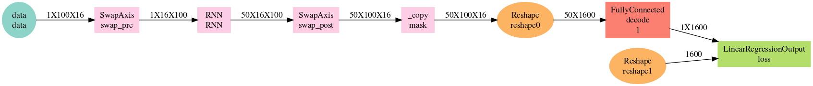

> LSTM application to time-series.  

This is a hacky demo of how one can perform a time-series model training and inference. 

Areas of friction come from the data feed that is expected in a features X batch.size X seq.len format, while array.iter assumes that batches are accessed through the last dimension. 

Current custom bucket iterator is designed for text data, which is in batch.size X seq.len format, the features dimension being added by the embedding layer. 

Might be preferrable to migrate bucket iterator to a seq_len X batch.size format and swap axis within model. First need to test potential impact on performance. 


```{r, echo=T, message=F}
library("readr")
library("dplyr")
library("plotly")
library("mxnet")
```

Load utility functions

```{r, echo=T}
source("rnn.graph.R")
source("rnn.infer.R")
```

### Data preparation

```{r, echo=TRUE}
pts <- sin(pi/16* (1:2001))
x <- pts[-length(pts)]
x = matrix(x, nrow = 20, byrow = T)
x = array(x, dim = c(1, 20, 100))
y <- pts[-1]
y = matrix(y, nrow = 20, byrow = T)

p1 = plot_ly(x = 1:dim(x)[3], y = x[1,1, ], type = "scatter", mode = "lines") %>% 
  add_trace(x = 1:dim(x)[3], y = x[1,2,], type = "scatter", mode = "lines") %>% 
  add_trace(x = 1:dim(x)[3], y = x[1,3,], type = "scatter", mode = "lines") %>% 
  add_trace(x = 1:dim(x)[3], y = x[1,4,], type = "scatter", mode = "lines") %>% 
  add_trace(x = 1:dim(x)[3], y = x[1,5,], type = "scatter", mode = "lines")

p2 = plot_ly(x = 1:length(y[1,]), y = y[1,], type = "scatter", mode = "lines") %>%
  add_trace(x = 1:length(y[2,]), y = y[2,], type = "scatter", mode = "lines")

plotly::export(p1, file = "timeseries_p1.png")
```

### Create data iterators

Hacky array.iter approach: batch.size = seq.length so that the graph is fed with the expected format. 

```{r}
batch.size = 100

train.data <- mx.io.arrayiter(data = x, label = y, 
                              batch.size = batch.size, shuffle = TRUE)
```


### Model architecture

```{r, echo=TRUE, fig.height=8}
symbol <- rnn.graph(num_rnn_layer =  2, 
                       num_hidden = 64,
                       input_size = NULL,
                       num_embed = NULL, 
                       num_decode = 1,
                       masking = F, 
                       loss_output = "linear",
                       dropout = 0.1, 
                       ignore_label = -1,
                       cell_type = "lstm",
                       output_last_state = T,
                       config = "one-to-one")

graph = graph.viz(symbol, type = "graph", direction = "LR", shape=list(data = c(1, 4, 100), label = c(4, 100)))
```

```{r}
DiagrammeRsvg::export_svg(graph) %>% charToRaw %>% rsvg::rsvg_png("time_graph.png")
```



### Fit a LSTM model

Another friction: metrics need to be customized under the current data format. 

```{r, echo=TRUE, eval=TRUE}
ctx <- mx.gpu()

initializer <- mx.init.Xavier(rnd_type = "gaussian", 
                              factor_type = "avg", 
                              magnitude = 2.5)

optimizer <- mx.opt.create("adadelta", rho = 0.9, eps = 1e-5, wd = 0,
                           clip_gradient = NULL, rescale.grad = 1/batch.size)

logger <- mx.metric.logger()
epoch.end.callback <- mx.callback.log.train.metric(period = 1, logger = logger)
epoch.end.callback <- mx.callback.log.train.metric(period = 1, logger = logger)

system.time(
  model <- mx.model.buckets(symbol = symbol,
                            train.data = train.data, eval.data = NULL, 
                            num.round = 2500, ctx = ctx, verbose = TRUE,
                            metric = NULL, 
                            initializer = initializer, optimizer = optimizer, 
                            batch.end.callback = NULL, 
                            epoch.end.callback = epoch.end.callback)
)

mx.model.save(model, prefix = "models/model_time_series", iteration = 1000)

```


## Inference on test data

Setup inference data. Need to apply preprocessing to inference sequence and convert into a infer data iterator. 

### Inference

```{r, echo=TRUE, eval=TRUE}
model <- mx.model.load(prefix = "models/model_time_series", iteration = 1000)

internals <- model$symbol$get.internals()
sym_state <- internals$get.output(which(internals$outputs %in% "RNN_state"))
sym_state_cell <- internals$get.output(which(internals$outputs %in% "RNN_state_cell"))
sym_output <- internals$get.output(which(internals$outputs %in% "loss_output"))
symbol <- mx.symbol.Group(sym_output, sym_state, sym_state_cell)

predict <- numeric()

data = mx.nd.array(x[, 1, , drop = F])
label = mx.nd.array(y[1, , drop = F])

infer_length = dim(data)[3]

infer.data <- mx.io.arrayiter(data = data, label = label, batch.size = batch.size, shuffle = FALSE)

mx.symbol.bind = mxnet:::mx.symbol.bind
infer <- mx.infer.buckets.one(infer.data = infer.data, 
                              symbol = symbol,
                              arg.params = model$arg.params, 
                              aux.params = model$aux.params, 
                              input.params = NULL,
                              ctx = ctx)

pred = mx.nd.array(y[1, batch.size, drop = F])

for (i in 1:100) {
  
  data = mx.nd.reshape(pred, shape = c(1,1,1))
  label = pred
  
  infer.data <- mx.io.arrayiter(data = data, label = label,  
                                batch.size = 1, shuffle = FALSE)
  
  infer <- mx.infer.buckets.one(infer.data = infer.data, 
                                symbol = symbol,
                                arg.params = model$arg.params,
                                aux.params = model$aux.params,
                                input.params = list(rnn.state = infer[[2]], 
                                                    rnn.state.cell = infer[[3]]), 
                                ctx = ctx)
  
  pred <- infer[[1]]
  predict <- c(predict, as.numeric(as.array(pred)))
  
}

```

### Plot predictions against real values

```{r}
data = mx.nd.array(x[, 1, , drop = F])
label = mx.nd.array(y[1, , drop = F])

real = y[2, 1:100]

p = plot_ly(x = 1:dim(y)[2], y = y[1,], type = "scatter", mode="lines", name = "hist") %>% 
  add_trace(x = dim(y)[2] + 1:length(real), y = real, type = "scatter", mode="lines", name = "real") %>% 
  add_trace(x = dim(y)[2] + 1:length(predict), y = predict, type = "scatter", mode="lines", name = "pred")

plotly::export(p, file = "timeseries_pred.png")
```

